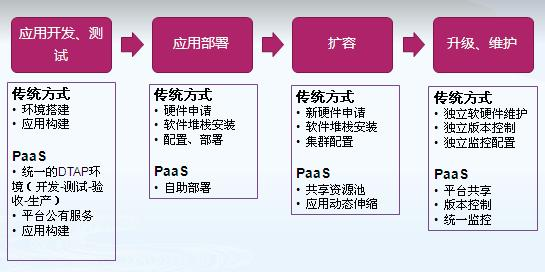

# **Sdp(SPC)项目文档,使用说明**

**Version**

*Simle Docker PaaS, version:1.0*

*Simle Private Cloud, Sdp-v2.0*

**友情链接：**

*如果你要访问我的博客，请到：*http://blog.saintic.com;

*如果你要访问我的源码，请到：*https://github.com/staugur;

如果你要访问我的

## **原理：**
1. 
泛解析一个域名(eg:*.saintic.com)到PaaS主服务器，容器即服务，所有的docker建立在分布式存储上，建立统一的数据仓库。
  
2. 
WEB型应用会生成一个包含用户名的三级域名，用户自己的域名cname到我们生成的域名上，由nginx反向代理提供一对一http路由映射到真正的docker容器上，提供FTP svn git(暂不支持)任意一种方式文件，代码上传功能，这样一个简单的PaaS。

3. 
APP型应用提供IP+PORT，并开放iptables，供用户远程应用。
  
4. 
所有关键文件均保存为JSON格式文件，由tools目录下的工具读取相应文件进行相应后续更新服务、邮件提醒等操作。

5. 
spmc:Sdp PaaS Manager Console,WEB文件，可随意放到支持PHP环境站点下或单独建个站点，以便通过网页形式创建和更新用户，支持PC端和移动端。
建议用Jenkins持续集成。

## **Directory description:**
**Version1.0, Sdp**

components:PaaS基础服务器，文件服务、容器服务。

boot:引导不同类型服务创建，引导用户生成、创建IP:PORT记录，触发文件服务功能，触发容器创建及分配和限制；

builds:创建容器中主要服务，提供PaaS应用；

tools:其他工具类脚本，如续费功能、服务到期邮件提醒功能等；

spmc:Sdp持续集成简易管理控制台，创建更新用户信息。

**Version2.0, SPC**
开发中……

## **PaaS:**
*Sdp定位是一个简单PAAS平台，旨在构建简单方便快捷的PAAS云。*

Sdp1.0局限性很大，尚只支持单机环境，自由度低，适用于个人用户；
Sdp2.0(SPC)完全分布式环境、大规模部署，自由度高，适用于组织及企业级应用。

 
*以下简单说说PaaS的功能：*

PaaS改变了传统的应用交付模式，促进了分工的进一步专业化，解耦了开发团队和运维团队。

结束语：
不论是大型企业，中小企业，软件开发商，软件供应商、运营商，还是开发和运维人员，都需充分认识到PaaS的战略核心地位和即将带来的变化，做好充分的准备，迎接PaaS时代的到来。

