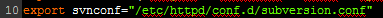
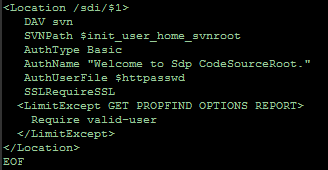

# Sdp组件之Subversion服务

Subversion即svn，是比较流行的版本管理系统；结合Apache Httpd Server可以通过http访问版本库，相应的，就可以使用httpd的SSL、验证等功能。

安装脚本位于Sdp/components下：

脚本是以YUM包管理系统安装的httpd和svn;

如果您不是按照脚本安装的，系统要求httpd配置目录为/etc/httpd/conf/httpd.conf，扩展配置目录为/etc/httpd/conf.d/，除非您修改sdp源码global.func，修改第十行，更改svnconf变量值。

 
保证可以使用/etc/init.d/httpd reload重载服务，也就是说在CentOS7或RHEL7的YUM安装方式上不适用。
默认安装中禁用了HTTPS功能，如果你有证书，可以设置Apache Httpd Server的SSL功能。

Tags标签stable即1.0默认global.func启用了SSL，如果没有那么需要将global.func中如下图断中的SSLRequireSSL前加#注释掉。

 
 
之后的版本默认注释掉，如果需要开启SSL将#去掉。

