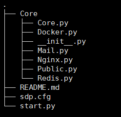

# Sdp v1.1(Py)整体概括

当前文档版本是1.0，源码版本地址是https://github.com/saintic/Sdp/tags/v1.1

更多介绍请参见v1.0，http://www.saintic.com/sdpv1.0/index.html

**一、原理：**

1.泛解析一个域名(*.saintic.top)到Sdp服务器上；

2.所有服务生成IP:PORT-->Container的映射关系，不考虑容器IP变化，只维护映射列表；

3.代码由纯python完成，成功返回Successful字样，并写入redis数据库中，错误则抛出具体错误信息。

4.简单结构图：


**二、包与模块:**

以下是version 1.1的文件结构：



**项目源码只有一个包，Core；入口文件是start.py，，配置文件是sdp.cfg。**

```
├── Core                 封装的模块包
│   ├── Core.py          核心模块，处理WEB或APP请求
│   ├── Docker.py        简单封装了docker-py
│   ├── __init__.py      代表是个包
│   ├── Mail.py          邮件模块
│   ├── Nginx.py         WEB请求的反向代理模块
│   ├── Public.py        公共函数模块
│   └── Redis.py         简单封装了Redis API
├── README.md            说明文件
├── sdp.cfg              配置文件
└── start.py             入口文件
```

**三、要求及使用**

**1.系统要求**
  
  >1.服务器本身有Nginx、redis、docker，可参照https://github.com/staugur/CoreWeb；
  
  >2.满足docker最低安装需求；
  
  >3.存在各服务的镜像；

  >4.防火墙开启一个端口列表，从配置文件STARTPORT设置的端口号开始，范围自定义；
  
  >5.Python第三方模块，docker-py,redis,configobj

**2.安装文档**

**3.使用文档**


**四、协议与反馈**

Sdp采用GPL v2协议，开放源代码，允许自由传播和二次开发，但原作者不负责任何法律责任。代码欢迎fork，若用于商业目的，请联系原作者，否则将追究法律责任。

编写过程中一个人难免有所纰漏，测试不到的地方，如遇无法解决的问题或出现BUG请及时提问，地址是：
[https://github.com/SaintIC/Sdp/issues](https://github.com/SaintIC/Sdp/issues)
