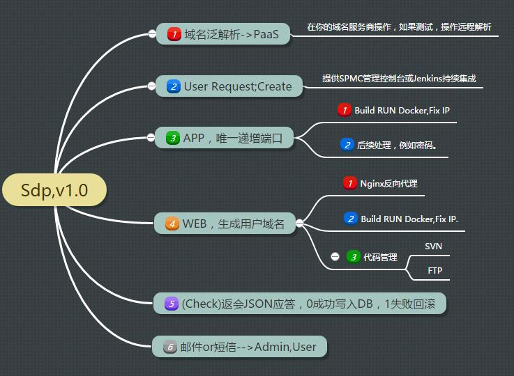
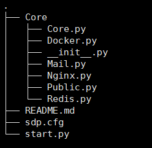
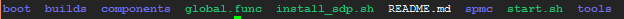
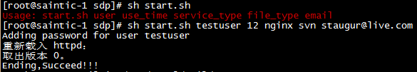
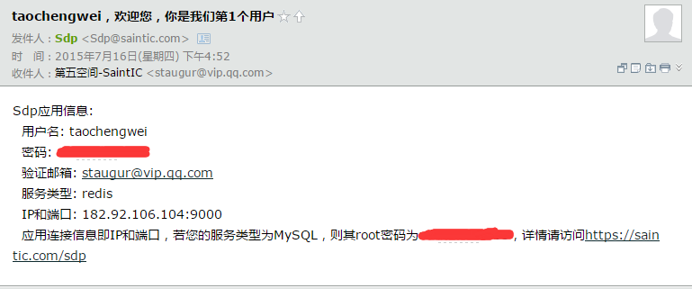
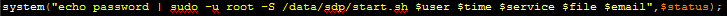
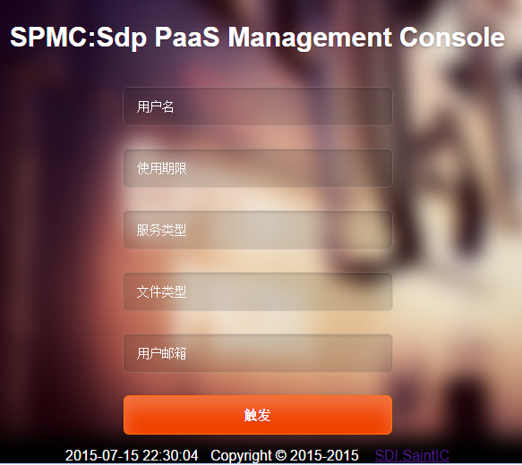

# Sdp v1.1(Py)整体概括

当前文档版本是1.0，源码版本地址是https://github.com/saintic/Sdp/tags/v1.1

更多介绍请参见v1.0，http://www.saintic.com/sdpv1.0/index.html

**一、原理：**

1.泛解析一个域名(*.saintic.top)到Sdp服务器上；

2.所有服务生成IP:PORT-->Container的映射关系，不考虑容器IP变化，只维护映射列表；

3.代码由纯python完成，成功返回Successful字样，并写入redis数据库中，错误则抛出具体错误信息。

4简单结构图：

**二、包与模块:**

**三、要求及使用**

**1.系统要求**

  由于是单机部署，并且开发的时候是以个人服务器为环境的，所以切换服务器有如下硬性要求：
  
  >1.服务器本身有Nginx服务，可参照https://github.com/staugur/CoreWeb；
  
  >2.硬件架构是CentOS6.5 x86_64位以上，要求满足docker最低安装需求；
  
  >3.存在标签为staugur/centos的容器，build或pull；

  >4.仅支持iptables，如果为firewalld类型，请关闭firewalld并开启iptables；
  
  >5.软件包：jq、mailx、subversion、python

**2.安装文档**

  提示：以下安装是基于拥有一定基础水平Linux(CentOS)人员进行的。
  
 ** 前提：请先阅读Docker、Subversion、Vsftpd或一键部署文章！！！**
  
   >1. yum –y install subversion mailx

   >2. svn co https://github.com/staugur/Sdp/tags/stable-0.1 sdp

   >3. cd sdp ; ls
   
  

   >4. cd components            //运行此下三个脚本或一键脚本安装docker、httpd+svn、vsftpd服务；

   >5. sh docker.sh ; sh svn.sh ; sh vsftpd.sh sdptest 123456 或者是install_sdp.sh   //确保中间没有报错,启动服务。

   >6. svn co https://github.com/staugur/CoreWeb/tags/v1.0.0 coreweb ; cd coreweb ; sh index.sh     //如下图，根据提示输入，输入数字1安装nginx。
  

   >7. 修改nginx、httpd监听地址或端口，其中需要nginx反向代理httpd+svn接受请求。

**3.使用文档**

*3.1 命令行*

  >1. cd sdp;
  
  >2. sh start.sh arg1 arg2 arg3 arg4 arg5
  
 
  >3. Sdp以start.sh脚本开始，此脚本需要五个参数，分别是user(用户) use_time(使用时间，单位月) service_type(服务) file_type(文件类型) email(用户邮箱)。

*3.2 参数要求*

1).用户名不冲突，同个用户需要多个服务当前版本必须多次以不同user执行；

2).使用时间不限，至少1个月(当前版本并不限制此值为0)；

3).服务类型：nginx、httpd、tomcat、mysql、mongodb、redis、memcached;

4).文件类型：若为web类型可支持ftp、svn，若为app类型默认无；

5).邮件提醒：部署成功后会发给用户一封信息邮件(确保不在垃圾邮件中)，大致内容包括用户名、密码、验证邮箱、服务类型，若为web服务类型则包含域名信息，否则为IP+PORT信息，若文件类型是svn则包含用户版本库地址，否则为FTP地址，最后是FAQ链接，此链接详细讲解用户应该如果使用邮件的信息。
 

*3.3 触发控制*

~~3.3.1 SPMC~~
  
  可以直接在web端访问触发，代码目录是spmc，将整个spmc目录复制到nginx网站根目录下或者单独建立虚拟主机，并修改exec.php中的密码部分：将password改为你服务器root密码，并将nginx或Apache、php-fpm的用户改为一个单独的用户，比如www，授予www无密码sudo权限。
  
 
Spmc界面如下(建议此界面web加密访问)：
  
  
~~3.3.2 Jenkins~~

  通过jenkins持续集成，具体方法在后面博客目录中写。
  

##三：联系我们
Sdp为开源项目，遵守GPLv3协议，诚请兴趣开发者；若用于商业目的请联系我们，否则将追究法律责任！

E-mail：staugur@saintic.com

